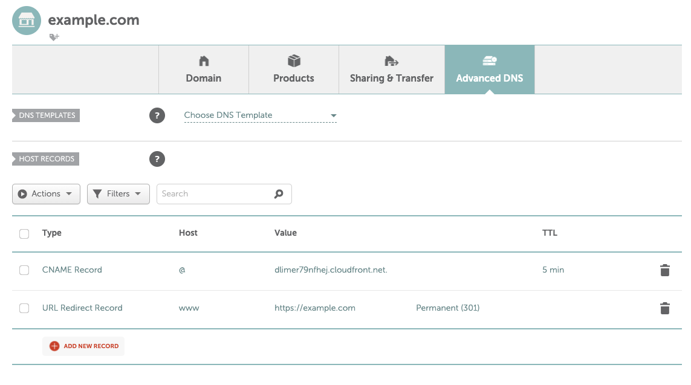

# Cloudfront Static Site

Quickly deploy a static site to AWS using CloudFront and S3 without using Route53.

Deploy a static site using S3 and CloudFront with a custom domain name with an external provider (to AWS). 

To deploy a static site quickly to CloudFront without the custom domain, please use [tkav/deploy-static-site](https://github.com/tkav/deploy-static-site).

This uses the terraform module, [tkav/terraform-aws-static-website](https://github.com/tkav/terraform-aws-static-website).

# Usage

## Requirements
- Terraform (>v1.0.0)

1. Update `variables.sh` and load environmental variables:
```
source variables.sh
```

2. Replace and add your static website contents to src folder. The distribution will look for index.html and 404.html pages. Make sure you have those.

3. Deploy your site:
```
make deploy_site
```
**IMPORTANT**
During this stage you will recieve an email to verify the certificate.
Open the email and approve the validation request. 

This will take several minutes. 

When completed, something like the following will be outputted:

```
Outputs:

cloudfront_domain = "dlimer79nfhej.cloudfront.net"
```

4. Add an `@` CNAME record to your domain using the `cloudfront_domain` above and add a `www` URL Redirect record pointing to your domain:



Once complete, your site will soon be available using your domain.


## Updating Site Content

If changes are made in the `src` folder, run the following to upload the changes to your S3 bucket:
```
make upload_site
```
This will also be run when contents are pushed to the repo with changes in the `src` folder.

If using the workflows, ensure you have updated the repository secrets with the following variables:
```
AWS_ACCESS_KEY_ID
AWS_SECRET_ACCESS_KEY
TF_VAR_REGION
TF_VAR_SITENAME
TF_VAR_TF_STATE_BUCKET
TF_VAR_WEBSITE_DOMAIN_MAIN
```

## Destroying the Site

To destroy EVERYTHING to do with this deployment:
```
make destroy
```
And confirm the steps.
S3 buckets, Cloudfront distributions and certificates will be deleted!
